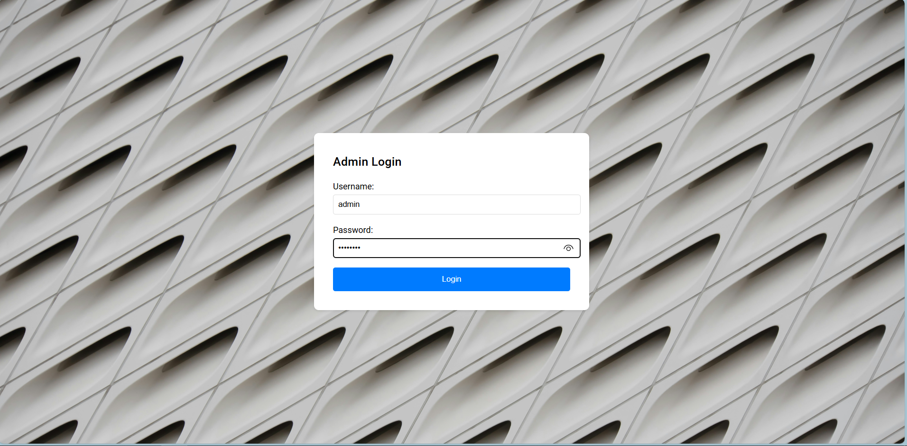
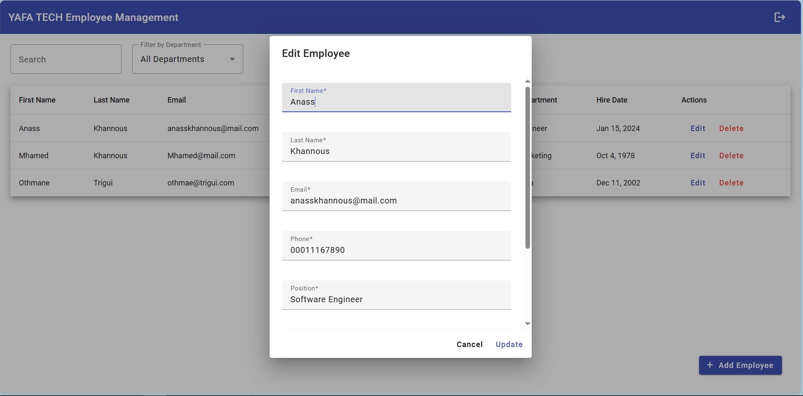

# Employee Management System

## Overview
This is a small Employee Management System built with a **Go (Golang)** backend and an **Angular** frontend. The application supports CRUD operations for employee data and user authentication.

---

## Prerequisites

### Backend
To run the backend:
- **Install Go**: Ensure you have Go installed on your system. You can download it from [golang.org](https://golang.org/).
- **Install Go dependencies**: Run the following command in the backend directory to install required packages:
  ```bash
  go mod tidy
  ```
- MongoDB: Install and configure MongoDB for employee data storage.

### Frontend
To run the frontend:
- **Install Node.js**: Download and install Node.js and npm from [nodejs.org](https://nodejs.org/).
- **Install Angular CLI**: Install the Angular CLI globally:
  ```bash
  npm install -g @angular/cli
  ```
- Ensure you are using **Angular 17**.

---

## How to Run the Application

### Backend
1. Navigate to the backend directory:
   ```bash
   cd test_yafa\src\app\controllers
   ```
2. Run the backend:
   ```bash
   go run main.go handlers.go
   ```
   The backend will be hosted on **http://localhost:8080**.
3. To test the backend, run:
   ```bash
   go test -v
   ```

### Frontend
1. Navigate to the frontend directory:
   ```bash
   cd test_yafa
   ```
2. Serve the frontend application:
   ```bash
   ng serve -o
   ```
   The frontend will be hosted on **http://localhost:4200** and will open in your default web browser.

---

## Admin Login Credentials
To access the admin account, use the following credentials:
- **Username**: `admin`
- **Password**: `admin123`

---

## Backend API Endpoints
Below is a list of the API endpoints implemented in the backend:

### Public Endpoints
- `POST /login`: Authenticate the user and return a JWT token.

### Protected Endpoints (Require Authorization Header with Bearer Token)
- `GET /api/employees`: Retrieve a list of all employees.
- `GET /api/employees/:id`: Retrieve details of a specific employee by ID.
- `POST /api/employees`: Add a new employee.
- `PUT /api/employees/:id`: Update details of an existing employee.
- `DELETE /api/employees/:id`: Delete an employee by ID.

---

## Technologies Used

### Backend
- Language: **Go (Golang)**
- Framework: **Gin** for routing and middleware
- Database: **MongoDB**
- JWT Authentication: **golang-jwt**

### Frontend
- Framework: **Angular 17**
- Styling: **Angular Material**
- Tooling: **Angular CLI**

---

This application provides a clean and simple interface for managing employee data while utilizing modern web technologies. Enjoy exploring the system!


## Screenshots







